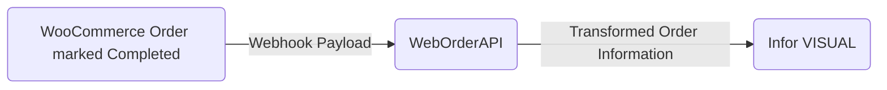

## Project Overview

-   **Span:** May – June 2023
    
-   **Context:** We needed a way to connect order completed in our webstore to our ERP system.
    
-   **Impact:** 
	- Over $2.3 million in sales processed since implementation
	- Error rate of .04% in order entry from webstore
## The Problem
We needed a way to have a record of orders which were marked as completed inside of our webstore in order to maintain proper inventory and sales numbers. 

## Constraints & Requirements
This solution had to be made within a month and needed to:
- Receive a webhook object from WooCommerce
- Convert that object to a Domain Order Model
- Persist that Order to our ERP through the provided Entity Relation Models.
 
## Our Solution
We designed the flow as follows: 

We chose to have the webhook trigger on "Completed" because we were using a 3PL company in order to actually fulfill our orders. The orders being created in our ERP were to mirror the actual cost and inventory flow out of 3PL. When the 3PL company would complete an order, their system would mark it "Completed" in our WooCommerce store.   

## Technical Implementation
### The Backend
#### .NET Framework 4.8 hosted via IIS
Although many of my core bachelors degree classes were in .NET Core, the Toolkit used to communicate with our ERP system only supports up to .NET Framework 4.8. After *a lot* of Google research, consulting the Toolkit documentation, and a little bit of idea bouncing on ChatGPT, I was finally able to piece together a working monolithic project that I could host on our on-premises IIS server. 
#### Microsoft SQL Server
Although primarily interacted through by using the provided ORM, some data and checks were retrieved with direct queries to the on-prem Microsoft SQL Server using MSSQL.

### External Connections
#### WooCommerce
I had never worked with WooCommerce before this project. I found it very straightforward to set up a Webhook, and the pre-built trigger topics were extensive enough to cover my use case perfectly. I also think they have excellent documentation for their [Rest API](https://woocommerce.github.io/woocommerce-rest-api-docs/) which allowed me to understand the footprint of the JSON objects used by WooCommerce.

### What Worked Well
### What Didn't Work Well

> Written with [StackEdit](https://stackedit.io/).## Project Overview

<!--stackedit_data:
eyJoaXN0b3J5IjpbLTE4MjA2MTUzMTcsMTQwOTI3MDc5N119
-->